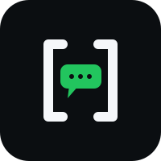

<h1>
  
  Yalla Chat
</h1>

A real-time chat application with **AI agents**, **scheduled messaging**, and **multi-channel notifications** (email & WhatsApp). Built with Laravel + Livewire, a terminal-inspired dark UI, and Reverb for real-time updates.

## Features

### 💬 Chat
- **Private 1:1 chats** — start a conversation with any user.
- **Group chats** — create groups with multiple participants and a group avatar.
- **Real-time messaging** — messages appear instantly via Reverb/Laravel Echo.
- **Presence / online status** — see who's online (presence channel).
- **Unread badges** — per-chat unread counters.
- **Avatars** — profile and group avatars (Spatie Media Library).
- **Remove chat** — leave/remove a conversation.

### 🤖 AI Agents
- Register multiple AI models (Big Pickle, DeepSeek V4 Flash, MiMo V2.5, Laguna S 2.1, Ling 3.0 Flash, North Mini Code, Nemotron 3 Ultra — free tier models via OpenCode).
- Per-model config: API key, **persona**, **tone**, **multi-language**, **auto-language**.
- One active model at a time (enabling one deactivates the others).
- **Auto-reply** — the agent replies on your behalf to incoming messages, with Google Calendar context.
- Connection check on registration.

### 📅 Scheduled Messages
- **Recurring** schedules (daily / weekly / monthly / yearly) or **specific dates**.
- **Multi-language** delivery (up to 3 languages per message).
- Target one or more chats.
- Full lifecycle: activate/deactivate, view, delete.
- **Broadcasts** — send now, pause/resume, and per-chat status tracking (`pending`, `sent`, `failed`, `overdue`, `paused`).
- Automated via a console command + queued jobs.

### 🔔 Notification Channels
- **Email** — configure with address + one-time verification code.
- **WhatsApp** — configure with phone number + one-time code (via WAHA HTTP integration).
- Connect / reconnect / remove / toggle active per channel.
- Rate-limited code sending, code expiry, and brute-force protection (Laravel `RateLimiter`).

### ⭐ Priority Chats & Urgent Notifications
- Mark a private chat as **priority** (requires a connected notification channel).
- When you're offline, the other user can send you an **urgent message** delivered through your configured channels (email / WhatsApp).
- Rate-limited (3 per hour per sender) and processed through the queue.
- Priorities are automatically cleared when a user's channels are removed/deactivated (model observer).

### 🔌 Integrations
- **Google Calendar** — OAuth, so the agent can reason about your schedule.
- **WhatsApp** — WAHA (WhatsApp HTTP API) via a Saloon connector.

### 🎨 UX
- Terminal / CLI-inspired dark theme (GitHub-dark palette, JetBrains Mono).
- Toast notifications (masmerise/livewire-toaster) for success/error feedback.

## Tech Stack

- **Backend:** Laravel (PHP), Livewire v4
- **Frontend:** Blade + Alpine.js + Tailwind CSS v4
- **Real-time:** Reverb + Laravel Echo (WebSockets)
- **Queue/Cache:** Redis + Laravel Horizon
- **AI:** `laravel/ai` (OpenCode provider) with tool support
- **Database:** MySQL
- **Media:** Spatie Media Library
- **HTTP clients:** Saloon (WhatsApp), Socialite (Google OAuth)
- **Server:** Laravel Octane (FrankenPHP)

## Requirements

- PHP 8.3+ (with `phpredis` / Redis)
- Composer
- Node.js + npm
- MySQL
- Redis
- A WAHA instance for WhatsApp (optional)
- Google OAuth credentials for Calendar (optional)

## Installation

```bash
git clone <repo-url> yalla-chat
cd yalla-chat

composer run setup   # installs deps, copies .env, key:generate, migrate, build assets
```

Or step by step:

```bash
composer install
cp .env.example .env
php artisan key:generate
php artisan migrate
npm install
npm run build
```

### Development

```bash
composer run dev   # runs: serve + queue + logs + vite (concurrently)
```

### Run with Docker

The `docker-compose.yml` targets production (pulls the Docker Hub image and serves behind Caddy). See [Deployment](#deployment).

### Run with Octane (FrankenPHP)

```bash
php artisan octane:start --server=frankenphp --workers=4
```

`OCTANE_SERVER` and `OCTANE_WORKERS` can also be set in `.env`.

## Environment Variables

| Variable | Description |
|---|---|
| `DB_*` | MySQL connection |
| `QUEUE_CONNECTION` | `redis` |
| `CACHE_STORE` | `redis` |
| `REDIS_*` | Redis connection |
| `MAIL_*` | SMTP (e.g. Mailtrap) |
| `GOOGLE_CLIENT_ID` / `GOOGLE_CLIENT_SECRET` / `GOOGLE_REDIRECT` | Google OAuth for Calendar |
| `WAHA_API_KEY` / `WAHA_SESSION` | WhatsApp HTTP API credentials |
| `VITE_REVERB_*` | Reverb WebSocket config (key/host/port/scheme) |

> The AI provider key is set per-model at runtime (each `AiModel` stores its own API key).

## Queues & Horizon

Queue names in use:

| Queue | Jobs |
|---|---|
| `default` | fallback / misc |
| `ai-agent-chat` | `ChatAgentJob` |
| `ai-scheduled-messages` | `SendScheduledMessagesJob` |
| `priority-notifications` | `EmailNotificationJob`, `WhatsappNotificationJob` |

Run the worker:

```bash
php artisan horizon        # dashboard at /horizon
# or
php artisan queue:work
```

## Real-time (Reverb)

Broadcast channels:

- `online` — presence channel for online users.
- `chat.{chatId}.{receiverId}` — private channel for new messages.
- `scheduled_message.{senderId}` — private channel for broadcast status updates.

```bash
php artisan reverb:start
```

## Deployment

The app ships as a single Docker image (`salehaldhaheri1010/yallachat`) running in multiple roles (app, reverb, horizon, scheduler, migrate) alongside MySQL, Redis, and Caddy for TLS + reverse proxy.

### CI/CD

`.github/workflows/production.yml` builds the image, pushes it to Docker Hub, then SSHes to the server and runs `docker compose pull && down && up -d`.

### Server files

The server only holds three files under `/var/www/yallachat`:

- `docker-compose.yml` — pulls the Docker Hub image
- `Caddyfile` — TLS + reverse proxy
- `.env.production` — secrets & configuration

### Bootstrap

```bash
curl -fsSL https://get.docker.com | sh
git clone <repo-url> /var/www/yallachat
# add .env.production, Caddyfile, docker-compose.yml
docker compose up -d
```

## Project Structure

```
app/
├── Action/          # dedicated use-case actions (send message, send email/whatsapp, …)
├── Ai/              # agents (ChatAgent, ScheduledMessageAgent) + tools (GoogleCalendarTool)
├── Enums/           # domain enums (models, services, channels, statuses)
├── Events/          # broadcast events (MessageSent, ScheduledMessageStatusChanged)
├── Http/            # controllers (OAuth)
├── Integration/     # WhatsApp (WAHA) Saloon integration
├── Jobs/            # queued jobs (notifications, chat agent, scheduled messages)
├── Livewire/        # full-stack components + pages
├── Mail/            # mailables (verification code, email notification)
├── Models/          # Eloquent models
├── Observers/       # NotificationChannelObserver
└── Services/        # domain services (channel config, notifications, …)
```

## License

Proprietary / internal project.
